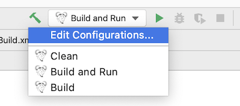

# Multi-user Plugin for Scout

## Introduction

Scout is a tool using a novel approach we call Augmented Testing (AT) to simplify Visual GUI Testing (VGT).

This repository serves as a template to develop a plugin for Scout without the complete Scout environment.

The main repository for Scout can be found [here](https://github.com/augmented-testing/scout).

## Requirements

Scout is developed in Java and therefore requires the Java Runtime Environment (JRE).
JRE version 8 or later is suitable for running Scout.

## Run Scout

You can run Scout either by clicking on the `Scout.jar` or using the command `java -jar Scout.jar`.
Before you can run Scout for the first time you have to build all plugins with `make build`.

## Plugin Development

Scout is a highly customizable tool due its plugin architecture. If you want to extend Scout's functionalities just create a new plugin in the `plugin/` folder.

A plugin should be independent and therefore should not contain any external dependencies. If necessary, external libs must be copied to the `bin/` directory. A good idea for plugin development (and development in general) is to follow the Keep it Simple/Stupid (KISS) principle.

If you have to mange multiple Java versions you could use the tool [SDKMAN](https://sdkman.io) which helps to maintain multiple JDK versions.

### Build and Run

Build automation is accomplished using a Makefile. To get an overview of all provided make targets run `make help`.

- To **build** all plugins: `make build`.
- To **build** all plugins and **run** Scout: `make run`.

### VSCode

If you decide to use VSCode as IDE than you have to install the [Java Extension Pack](https://marketplace.visualstudio.com/items?itemName=vscjava.vscode-java-pack) to be able to develop a plugin.

You can find more information about how to manage Java projects in VSCode following this [link](https://code.visualstudio.com/docs/java/java-project).

### IntelliJ

If you use IntelliJ we recommend you to use the [Makefile Language](https://plugins.jetbrains.com/plugin/9333-makefile-language) extension to use the already defined build and run tasks. See the screenshot.

## License

Copyright (c) 2021 Andreas Bauer

This work (source code) is licensed under [MIT](./LICENSES/MIT.txt).

Files other than source code are licensed as follows:

- Documentation and screenshots are licensed under [CC BY-SA 4.0](./LICENSES/CC-BY-SA-4.0.txt).

See the [LICENSES](./LICENSES/) folder in the root of this project for license details.
